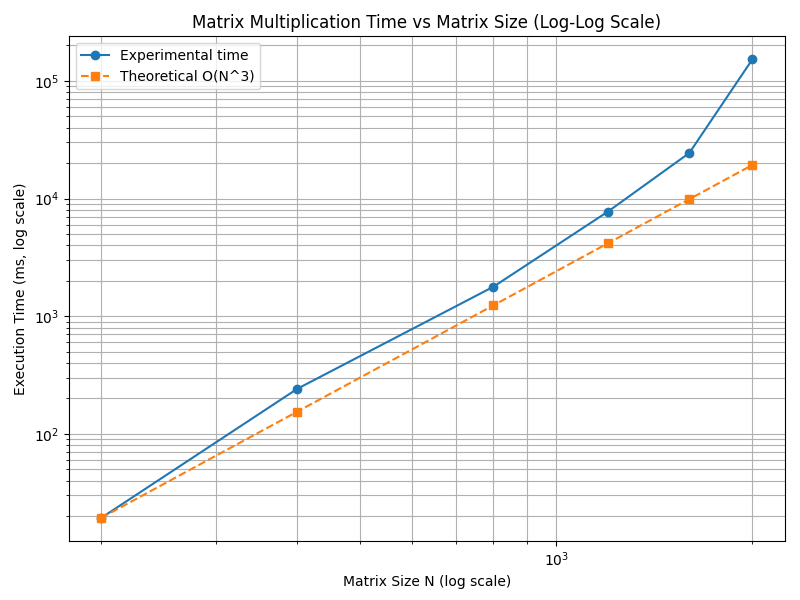
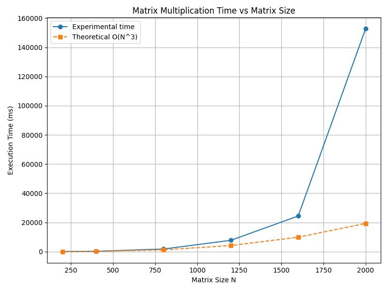

# Лабораторная работа №1: Умножение квадратных матриц

## 1. Цель работы
Реализация алгоритма умножения квадратных матриц на C++, анализ производительности решения и верификация результатов путем сравнения с эталонными вычислениями библиотеки NumPy (Python).

## 2. Результаты тестового запуска (N=5)
Тестирование проводилось на матрицах размерностью 5×5. Данные взяты из файла `results.txt`.

**Параметры задачи:**
- Размерность матриц: 5×5
- Элементов в одной матрице: 25
- Всего элементов (A, B, C): 75
- Количество арифметических операций (сложения и умножения): 250

**Временные затраты:**
- 47 мкс (0.047 мс или 0.000047 с)

**Производительность:**
- ~5.32 MFLOPS

## 3. Верификация корректности
Для подтверждения правильности работы алгоритма результаты выполнения C++ программы были сравнены с матрицей, полученной через `numpy.dot` в Python.

**Результирующая матрица (C++ и NumPy т.к. совпали):**

| | Col 1 | Col 2 | Col 3 | Col 4 | Col 5 |
|---|---|---|---|---|---|
| **Row 1** | 110 | 118 | 112 | 84 | 112 |
| **Row 2** | 121 | 121 | 146 | 84 | 107 |
| **Row 3** | 80 | 103 | 73 | 92 | 118 |
| **Row 4** | 109 | 119 | 85 | 82 | 143 |
| **Row 5** | 119 | 122 | 132 | 98 | 99 |

**Вывод по верификации:**
Матрицы полностью идентичны. Алгоритм работает корректно. Дополнительная проверка для больших размерностей (от 200 до 2000) также подтвердила совпадение результатов с точностью до $10^{-10}$.

## 4. Анализ производительности

**Теоретическая оценка:**
Классический алгоритм имеет сложность $O(N^3)$. Общее число операций приблизительно равно $2N^3$.

**Экспериментальные данные:**
Замеры времени и производительности (MFLOPS) для различных $N$:

| N | Время (мкс) | Время (мс) | MFLOPS |
|---|---|---|---|
| 200 | 19 297 | 19.30 | 829.14 |
| 400 | 241 357 | 241.36 | 530.33 |
| 800 | 1 777 326 | 1777.33 | 576.15 |
| 1200 | 7 752 326 | 7752.33 | 445.80 |
| 1600 | 24 407 361 | 24407.36 | 335.64 |
| 2000 | 152 745 297 | 152745.30 | 104.75 |

### Графики производительности и времени выполнения

Ниже представлены графики, иллюстрирующие зависимость времени выполнения и производительности алгоритма умножения матриц от размерности N.

#### 1. Производительность (MFLOPS) vs Размер матрицы N

*Производительность падает с ростом N из-за выхода за пределы кэша процессора.*

---

#### 2. Время выполнения vs Размер матрицы N (линейная шкала)

*Экспериментальное время растёт быстрее теоретического O(N³) на больших N — это связано с накладными расходами памяти и кэш-промахами.*

---

#### 3. Время выполнения vs Размер матрицы N (логарифмическая шкала)

*На логарифмической шкале видно, что экспериментальная кривая близка к теоретической O(N³), особенно при малых N. Отклонения на больших N обусловлены архитектурными особенностями системы.*

## 5. Итоговые выводы

1. **Корректность:** Реализация на C++ верно выполняет умножение матриц. Полное совпадение с эталоном NumPy доказано для всех тестовых размеров.
2. **Сложность:** Экспериментально подтверждена кубическая зависимость времени выполнения от размерности матрицы ($O(N^3)$), что соответствует теории.
3. **Производительность:**
   - При малых $N$ ($\le 200$) наблюдается высокая эффективность (~830 MFLOPS) за счет попадания данных в кэш процессора.
   - С ростом $N$ производительность снижается. При $N > 800$ данные перестают помещаться в кэш, что приводит к падению скорости.
   - Для $N=2000$ производительность составляет ~105 MFLOPS, что характерно для наивной реализации без использования блочных алгоритмов, векторизации (SIMD) или многопоточности.
