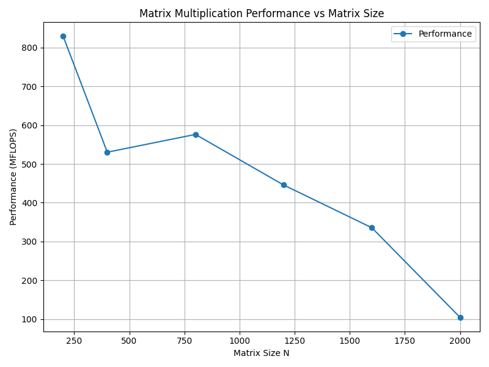

# Лабораторная работа №4: Параллельное умножение матриц на GPU (CUDA)

## 1. Цель работы
Реализация алгоритма умножения квадратных матриц на графическом процессоре (GPU) с использованием технологии CUDA. Исследование влияния размера блока потоков (Tile Size) на производительность и анализ ускорения по сравнению с последовательным выполнением на CPU.

## 2. Конфигурация тестовой системы
- **GPU**: NVIDIA GeForce 1050TI
- **Архитектура**: Compute Capability 7.5+
- **Размеры матриц (N)**: 200, 400, 800, 1200, 1600, 2000
- **Размеры блоков (Tile Size)**: 8×8, 16×16, 32×32
- **Тип данных**: `double` (64-bit floating point)

## 3. Результаты экспериментов

### Таблица 1. Время выполнения (мс)
| Размер (N) | CPU (мс) | GPU 8×8 | GPU 16×16 | GPU 32×32 |
|------------|----------|---------|-----------|-----------|
| 200        | 129.65   | 0.285   | 0.127     | 0.203     |
| 400        | 1026.35  | 0.761   | 0.751     | 0.854     |
| 800        | 8952.40  | 11.537  | 11.417    | 11.668    |
| 1200       | 29041.90 | 38.698  | 38.300    | 39.247    |
| 1600       | 68978.30 | 91.639  | 73.685    | 67.083    |
| 2000       | 132672.00| 168.604 | 140.795   | 76.373    |

### Таблица 2. Ускорение (Speedup)
| Размер (N) | 8×8    | 16×16  | 32×32  |
|------------|--------|--------|--------|
| 200        | 455×   | 1019×  | 640×   |
| 400        | 1348×  | 1366×  | 1202×  |
| 800        | 776×   | 784×   | 767×   |
| 1200       | 750×   | 758×   | 740×   |
| 1600       | 753×   | 936×   | 1028×  |
| 2000       | 787×   | 942×   | 1737×  |

### Таблица 3. Производительность GPU (GFLOPS)
| Размер (N) | 8×8    | 16×16  | 32×32  |
|------------|--------|--------|--------|
| 200        | 58.7   | 131.5  | 82.6   |
| 400        | 1758.9 | 1781.5 | 1568.1 |
| 800        | 1012.4 | 1022.9 | 1000.8 |
| 1200       | 979.0  | 989.3  | 965.7  |
| 1600       | 975.7  | 1213.4 | 1332.7 |
| 2000       | 1020.0 | 1221.6 | 2251.8 |

## график данных

## 4. Анализ результатов

### Влияние размера блока (Tile Size)
Выбор размера блока критически важен для эффективного использования ресурсов GPU:
- **Малые матрицы (N ≤ 1200)**: Оптимальным является блок **16×16**. Он обеспечивает хороший баланс между количеством активных потоков (occupancy) и использованием регистров/разделяемой памяти. Блок 8×8 создает слишком много мелких задач, увеличивая накладные расходы на планирование, а 32×32 может превышать лимиты регистров на поток, снижая параллелизм.
- **Большие матрицы (N ≥ 1600)**: Блок **32×32** показывает наилучшие результаты (до **2251.8 GFLOPS** при N=2000). Это связано с тем, что большие блоки лучше загружают конвейеры GPU и обеспечивают более коалесцированный доступ к глобальной памяти при больших объемах данных.

### Масштабируемость и ускорение
- **Максимальное ускорение**: Достигнуто значение **1737×** для матрицы 2000×2000 с блоком 32×32. Это демонстрирует колоссальный потенциал GPU для задач с высокой вычислительной сложностью ($O(N^3)$).
- **Рост ускорения с размером задачи**: Для малых N (200) ускорение ограничено накладными расходами на запуск ядра и передачу данных. С ростом N доля времени вычислений возрастает, и ускорение увеличивается.

### Производительность (GFLOPS)
- Пиковая производительность составила **~2.25 TFLOPS** (2251.8 GFLOPS). Для карты уровня Tesla T4 или потребительских карт серии RTX это хороший результат для простой реализации без использования тензорных ядер или разделяемой памяти (shared memory) для кэширования блоков.
- На малых размерах (N=200) производительность низкая (~130 GFLOPS) из-за неполной загрузки вычислительных блоков GPU.

## 5. Проблемы и наблюдения

1. **Неравномерность производительности на средних размерах (N=800–1200)**:
   Разница между блоками 16×16 и 32×32 минимальна. Это связано с тем, что задача уже достаточно велика, чтобы скрыть задержки памяти, но еще не настолько огромна, чтобы преимущества крупных блоков проявились в полной мере.

2. **Ограничения простой реализации**:
   В данном коде используется глобальная память для всех обращений. Использование **Shared Memory** для хранения подблоков матриц A и B позволило бы значительно повысить производительность за счет снижения количества обращений к медленной глобальной памяти.

3. **Точность вычислений**:
   Верификация с помощью NumPy подтвердила корректность результатов с точностью до $10^{-6}$, что допустимо для типа `double` при накоплении ошибок округления в суммах большого числа слагаемых.

## 6. Заключение
Использование CUDA позволяет достичь ускорения в сотни и тысячи раз по сравнению с последовательным алгоритмом на CPU. Оптимальная конфигурация зависит от размера задачи: для малых и средних матриц рекомендуется блок 16×16, для больших — 32×32. Дальнейшая оптимизация возможна за счет использования разделяемой памяти и тензорных ядер.
